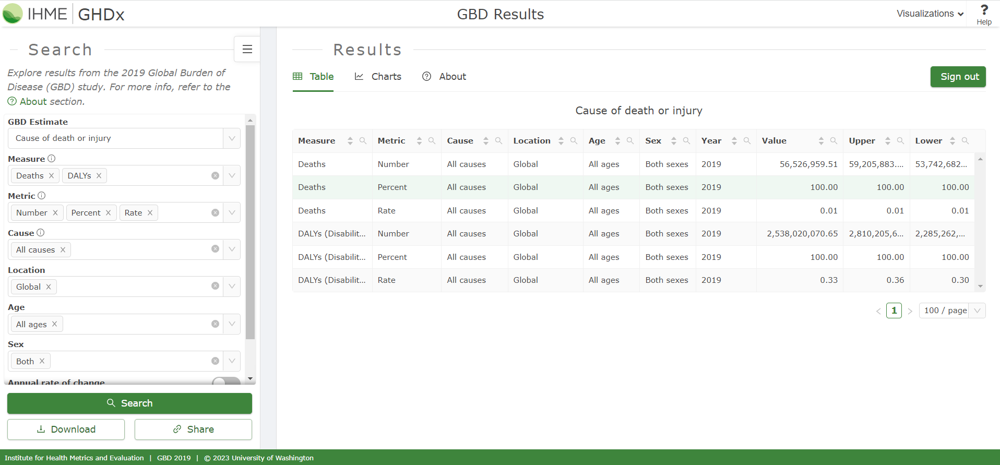

```{r setup, echo=FALSE}

knitr::opts_chunk$set(echo = TRUE, fig.path = "static")

```

Em uma das primeiras aulas do curso *"Descriptive Epidemiology of Diseases and Injuries: the Global Burden of Disease Study"* (PPGEpi/UFRGS) foi discutido um exemplo a respeito da **doença pulmonar obstrutiva crônica** (*chronic obstructive pulmonary disease*, COPD). Neste *post*, vamos ver como construir um gráfico para apresentar a carga de COPD por faixa etária.

## COPD

A COPD é uma inflamação crônica dos pulmões que causa tosse, dificuldade respiratória, muco e chiado no peito. A COPD inclui enfisema e bronquite crônica.

## DALYs

Os **anos de vida ajustados por incapacidade** (*Disability‐adjusted life years*, DALYs) refletem de forma abrangente perdas de saúde fatais e não fatais e são definidos como a combinação de **anos de vida perdidos** (*years of life lost*, YLLs) e **anos vividos com incapacidade** (*years lived with disability*, YLDs)^[Murray CJ. Quantifying the burden of disease: the technical basis for disability-adjusted life years. Bull World Health Organ. 1994;72(3):429-45. PMID: 8062401; PMCID: PMC2486718.]. Os YLLs representam as perdas de saúde devido à morte prematura em comparação com a expectativa de vida padrão. Os YLDs são calculados multiplicando-se o número de pessoas vivendo com esse desfecho pelo **peso da incapacidade** que representava a magnitude da perda de saúde associada ao desfecho.

Dessa forma, os DALYs expressam a carga de uma determinada doença. Em um *post* futuro, pretendo abordar a definição dos DALYs, YLLs, YLDs, expectativa de vida padrão, pesos de incapacidade e os dados envolvidos na estimativa destas quantidades populacionais.

## Extraindo os dados

Antes de construir o gráfico, precisamos ter acesso aos dados. Os dados sobre a carga global de COPD foram extraídos usando a ferramenta *GBD Results Tool* do [Global Health Data Exchange](http://ghdx.healthdata.org/gbd‐results‐tool) do **GBD 2019**. 

{width=60% height=50%}

No primeiro acesso ao *GBD Results Tool* é necessário realizar um cadastro. Na aba *About* são disponibilizados manuais básicos para uso da ferramenta.

{width=60% height=50%}

Para este exemplo, a seguinte configuração foi especificada:

{width=40% height=50%}

O resultado da consulta pode ser visualizado na tela do GBD Results. Ao clicar no botão *Download* o usuário tem acesso ao arquivo de dados em `csv`^[Global Burden of Disease Collaborative Network. Global Burden of Disease Study 2019 (GBD 2019) Results. Seattle, United States: Institute for Health Metrics and Evaluation (IHME), 2020. Available from https://vizhub.healthdata.org/gbd-results/.]. Este arquivo será utilizado para a construção do gráfico.

## Gráfico de DALYs por idade

Uma vez que baixamos o arquivo de dados, vamos importá-lo para o `R`.

```{r, echo=TRUE, warning=FALSE, message=FALSE}

library(readr)

gbd_copd <- read_csv(file = here::here("data",
                                "IHME-GBD_2019_DATA-a45abb03-1.csv"))

```

Aqui utilizamos a função `read_csv` do pacote [`readr`](https://readr.tidyverse.org/). Além disso, utilizamos a função `here` do pacote de mesmo nome. Se você ainda não conhece a função `here` veja este [*post*](https://www.tidyverse.org/blog/2017/12/workflow-vs-script/) sobre fluxo de trabalho orientado a projetos em `R`.

Veja que os dados estão no formato "longo", pois os dados de YLLs, YLDs, DALYs, assim como sexo masculino, feminino e ambos os sexos encontra-se "empilhados".

```{r, echo=TRUE, warning=FALSE, message=FALSE}

gbd_copd

```

O próximo passo é formatar as variáveis de interesse. Isso vai facilitar o nosso trabalho final de construção do gráfico. Assim, vamos ordenar corretamente os níveis da variável *idade* (`age`) e atribuir os rótulos desejados.

```{r, echo=TRUE, warning=FALSE, message=FALSE}

gbd_copd$age <- factor(
  x = gbd_copd$age,
  levels = unique(gbd_copd$age),
  labels = c(
    c("Early Neonatal", "Late Neonatal", "Post Neonatal"),
    unique(gbd_copd$age)[4:19],
    paste(unique(gbd_copd$age)[20:22], "years"),
    unique(gbd_copd$age)[23]
  )
)

```

Com o auxílio do pacote [`dplyr`](https://dplyr.tidyverse.org/), vamos também aproveitar para transformar os nomes da variável `measure` em nomes mais curtos.

```{r, echo=TRUE, warning=FALSE, message=FALSE}

library(dplyr)

gbd_copd <- gbd_copd %>% 
  mutate(measure = case_when(
    measure == "YLDs (Years Lived with Disability)" ~ "YLDs",
    measure == "YLLs (Years of Life Lost)" ~ "YLLs",
    measure =="DALYs (Disability-Adjusted Life Years)" ~ "DALYs")
    )

```

### Gráfico de barras simples

Neste primeiro gráfico, vamos apresentar a informação da carga global de COPD para ambos os sexos no ano de 2019 em número de DALYs. Assim, vamos filtrar os dados pelas variáveis `measure` e `sex`.

```{r, echo=TRUE, warning=FALSE, message=FALSE}

gbd_copd_daly_b <- gbd_copd %>% 
  filter(measure == "DALYs", sex == "Both")

```

Para construir o __gráfico de barras__ utilizaremos o pacote `ggplot2`^[Se __você ainda não conhece__ o pacote `ggplot2`, não deixe de conferir o material do minicurso [Pintando e Bordando no R](https://datathon-ufrgs.github.io/Pintando_e_Bordando_no_R/) apresentado no [1º Datathon da UFRGS](https://www.ufrgs.br/datathon/).]. Agora que já filtramos os dados de DALYs, vamos utilizar as variáveis `val` (os valores referentes ao número de DALYs) e `age`.

```{r, echo=TRUE, warning=FALSE, message=FALSE}

library(ggplot2)

p1 <- ggplot(data = gbd_copd_daly_b,
             mapping = aes(x = age, y = val)) +
  geom_bar(stat = "identity") + 
  labs(x = "Age group", y = "DALYs")
p1

```

Notamos que muitos aspectos do gráfico podem ser melhorados, tais como o **tema**, as **cores** e a **largura** das barras e os **rótulos dos eixos**.

```{r, echo=TRUE, warning=FALSE, message=FALSE}

p1 <- ggplot(data = gbd_copd_daly_b,
             mapping = aes(x = age, y = val)) +
  geom_bar(stat = "identity", width = 0.6, fill = "#b19cd9") +
  scale_y_continuous(breaks = c(0, 5000000, 10000000)) +
  labs(x = "Age group", y = "DALYs") +
  theme_bw() +
  theme(
    axis.text.x = element_text(hjust = 1,
                               angle = 45,
                               size = 8))
p1

```

### Gráfico de barras com barra erro (incerteza)

Os dados disponibilizados pelo GBD são estimativas de quantidades populacionais. Além das estimativas pontuais, o GBD também disponibiliza os limites de um **intervalo de incerteza**^[A razão de se utilizar o termo "intervalo de incerteza" no lugar de "intervalo de credibilidade" é algo que ainda não compreendo bem.] de 95% (variáveis `upper` e `lower` do objeto de dados). Vamos incorporar estes intervalos em nosso gráfico. Para isso, vamos acrescentar uma "camada" ao gráfico anterior.

```{r, echo=TRUE, warning=FALSE, message=FALSE}

p2 <- p1 +
  geom_errorbar(aes(ymin = lower, ymax = upper),
                colour = "black", width = .1)

p2

```

### Gráfico de barras com YLLs, YLDs e sexo

Como os DALYs expressam a soma dos YLLs e YLDs, seria interessante apresentar no gráfico a contribuição de YLLs e YLDs para os DALYs de COPD. Além, disso estratificar este dado por sexo. Assim, filtramos o objeto de dados `gbd_copd` (que contém a informação completa do arquivo baixado do *GBD Results Tool*) e criamos a variável que combina os níveis da variável `sex` com os níveis da variável `measure`.

```{r, echo=TRUE, warning=FALSE, message=FALSE}

gbd_copd_yl_mf <- gbd_copd %>% 
  filter(measure != "DALYs", sex != "Both") %>%
  mutate(sex = factor(x = sex),
         sex = relevel(sex, ref = "Male"),
         measure = factor(x = measure),
         measure = relevel(measure, ref = "YLLs"),
    sex_measure = interaction(sex, measure, sep = ", "))

```

A estrutura do gráfico é parecida com o gráfico de barras simples. Devemos apenas acrescentar o elemento `fill` aos elementos estéticos do gráfico (função `aes`).

```{r, echo=TRUE, warning=FALSE, message=FALSE}

p3 <- ggplot(data = gbd_copd_yl_mf,
             mapping = aes(x = age, y = val, fill = sex_measure)) +
  geom_bar(stat = "identity", width = 0.6) +
  scale_y_continuous(breaks = c(0, 5000000, 10000000)) +
  labs(x = "Age group", y = "DALYs", fill = "") +
  theme_bw() +
  theme(
    axis.text.x = element_text(hjust = 1,
                               angle = 45,
                               size = 8))
p3

```

Sempre podemos especificar um outro tema, ou outra paleta de cores, assim como configurar a posição da legenda do gráfico.

```{r, echo=TRUE, warning=FALSE, message=FALSE}

library(wesanderson)

p3 <- ggplot(data = gbd_copd_yl_mf,
             mapping = aes(x = age, y = val, fill = sex_measure)) +
  geom_bar(stat = "identity", width = 0.6) +
  scale_y_continuous(breaks = c(0, 5000000, 10000000)) +
  scale_fill_manual(values = rev(wes_palette(n = 4, name = "GrandBudapest2"))) +
  labs(x = "Age group", y = "DALYs", fill = "") +
  theme_classic() +
  theme(
    legend.position = "bottom",
    axis.text.x = element_text(hjust = 1,
                               angle = 45,
                               size = 8))
p3

```

Uma alternativa a este último gráfico é utilizar a variável `measure` no argumento `fill` e a variável `sex` com a função `facet_grid`.

```{r, echo=TRUE, warning=FALSE, message=FALSE}

p4 <- ggplot(data = gbd_copd_yl_mf,
             mapping = aes(x = age, y = val, fill = measure)) +
  geom_bar(stat = "identity", width = 0.6) +
  # scale_y_continuous(breaks = c(0, 5000000, 10000000)) +
  scale_fill_manual(values = rev(wes_palette(n = 4, name = "GrandBudapest2"))) +
  labs(x = "Age group", y = "DALYs", fill = "") +
  theme_classic() +
  theme(
    legend.position = "bottom",
    axis.text.x = element_text(hjust = 1,
                               angle = 45,
                               size = 8)) +
  facet_grid( ~ sex)
p4

```

O resultado é um painel com dois gráficos, um para cada nível da variável `sex`. Depois é só salvar no formato e resolução que você desejar com a função [`ggsave`](https://ggplot2.tidyverse.org/reference/ggsave.html)!
