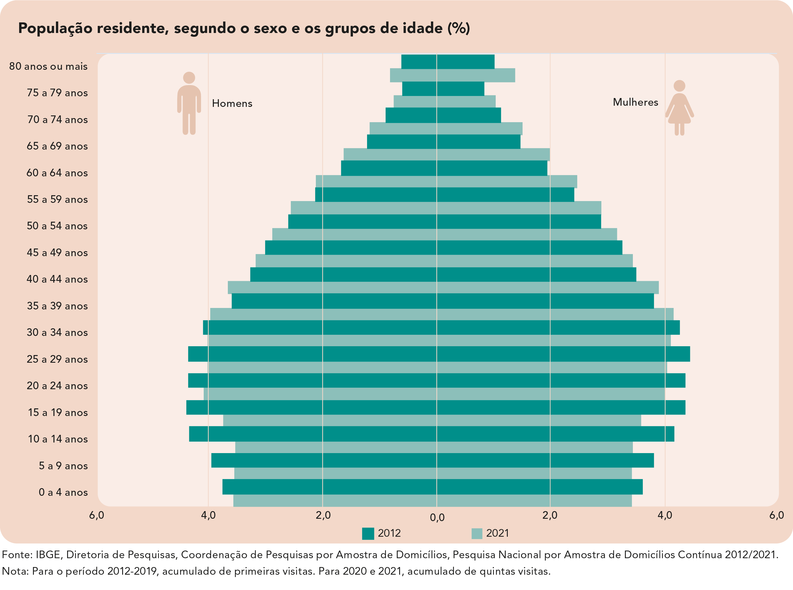
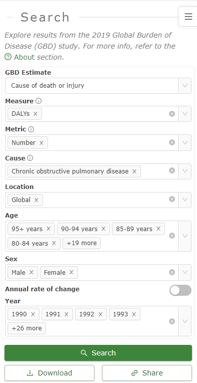

```{r setup, echo=FALSE}

knitr::opts_chunk$set(echo = TRUE, fig.path = "static")

```

No [último *post*](https://rdosreis.github.io/2023/01/28/gbdrawer-02-a-carga-de-copd-por-idade/) discutimos a construção de gráficos para apresentação da carga de **doença pulmonar obstrutiva crônica** (*chronic obstructive pulmonary disease*, COPD). Utilizamos gráficos de barras para descrever a distribuição de DALYs por faixa etária. Neste novo *post* continuaremos a discutir este exemplo, apresentando um **gráfico de pirâmide** como alternativa aos gráficos de barras simples.

## Gráfico de pirâmide

O gráfico de pirâmide é um gráfico muito utilizado para apresentar a distribuição etária de uma população por gênero.

{width=80% height=80%}

É um gráfico bastante útil para se fazer comparações entre anos/períodos e avaliar mudanças no padrão etário de uma população ao longo do tempo. Vamos construir este gráfico para apresentar a distribuição de DALYs de COPD global por idade e gênero.

## Gráfico de DALYs por faixa etária ao longo dos anos

### Extração dos dados

Mais uma vez, utilizamos a ferramenta *GBD Results Tool* do [Global Health Data Exchange](http://ghdx.healthdata.org/gbd‐results‐tool) do **GBD 2019** para obter os dados sobre a carga global de COPD. Para este exemplo, a seguinte configuração foi especificada:

{width=80% height=80%}

### Carregando os dados

Uma vez que baixamos os dados, vamos carregá-los para o `R`.

```{r, echo=TRUE, warning=FALSE, message=FALSE}

library(readr)

gbd_copd <- read_csv(file = here::here("data",
                                "IHME-GBD_2019_DATA-4fea7ca1-1.csv"))

```

De acordo com a configuração da nossa consulta (no *GBD Results Tool*) temos informação para valores de DALYs, em ambos os sexos e para cada ano de 1990 até 2019.

```{r, echo=TRUE, warning=FALSE, message=FALSE}

gbd_copd

```

### Formatando os dados

Como no gráfico de barras simples, vamos formatar os dados antes de gerar o gráfico.

```{r, echo=TRUE, warning=FALSE, message=FALSE}

gbd_copd$age <- factor(
  x = gbd_copd$age,
  levels = unique(gbd_copd$age),
  labels = c(
    c("Early Neonatal", "Late Neonatal", "Post Neonatal"),
    unique(gbd_copd$age)[4:19],
    paste(unique(gbd_copd$age)[20:22], "years"),
    unique(gbd_copd$age)[23]
  )
)

```

Para produzir um gráfico de pirâmide, em que as barras horizontais têm a origem no valor zero do eixo $x$ e sentidos opostos para cada nível da variável `sex` (da esquerda para direita para DALYs do sexo feminino e da direita para esquerda para DALYs do sexo masculino), precisamos multiplicar os valores de DALYs para o sexo masculino por $-1$.

```{r, echo=TRUE, warning=FALSE, message=FALSE}

gbd_copd$val[gbd_copd$sex == "Male"] <-
  -gbd_copd$val[gbd_copd$sex == "Male"]

```

### DALYs de COPD por idade e sexo: 2019

Vamos filtrar os dados referentes ao ano de 2019 utilizando a função `filter` do pacote [`dplyr`](https://dplyr.tidyverse.org/)^[Para uma introdução ao operador *pipe* (`%>%`), veja: https://magrittr.tidyverse.org/reference/pipe.html].

```{r, echo=TRUE, warning=FALSE, message=FALSE}

gbd_copd_19 <- gbd_copd %>% 
  filter (year == 2019)

```

Agora, vamos utilizar o pacote `ggplot2` para construir o gráfico de pirâmide. O primeiro passo é construir um gráfico de barras.

```{r, echo=TRUE, warning=FALSE, message=FALSE}

library(ggplot2)

p <- ggplot(data = gbd_copd_19,
            mapping = aes(x = age,
                          y = val,
                          fill = sex)) +
  geom_bar(stat = "identity") + 
  labs(x = "Age group", y = "DALYs", fill = "Sex",
       title = "Carga global de COPD. DALYs por faixa etária, ano: 2019",
       caption = "Global Burden of Disease Study 2019 (GBD 2019) Results. Seattle, United States: Institute for Health Metrics and Evaluation (IHME), 2020. Available from https://vizhub.healthdata.org/gbd-results/.") +
  theme_minimal() +
  theme(legend.position = "bottom")
p

```

Note que o gráfico gerado se parece muito com o resultado esperado, porém as barras estão na posição vertical e os valores de DALYs para o sexo masculino são mostrados com o sinal negativo. Vamos utilizar a função `coord_flip` para inverter os eixos do gráfico.

```{r, echo=TRUE, warning=FALSE, message=FALSE}

p <- ggplot(data = gbd_copd_19,
            mapping = aes(x = age,
                          y = val,
                          fill = sex)) +
  geom_bar(stat = "identity") + 
  labs(x = "Age group", y = "DALYs", fill = "Sex",
       title = "Carga global de COPD. DALYs por faixa etária, ano: 2019",
       caption = "Global Burden of Disease Study 2019 (GBD 2019) Results. Seattle, United States: Institute for Health Metrics and Evaluation (IHME), 2020. 
       Available from https://vizhub.healthdata.org/gbd-results/.") +
  theme_minimal() +
  theme(legend.position = "bottom") +
  coord_flip()
p

```

Ainda, podemos modificar a paleta de cores e formatar os labels do eixo horizontal.

```{r, echo=TRUE, warning=FALSE, message=FALSE}

library(RColorBrewer)

p <- ggplot(data = gbd_copd_19,
            mapping = aes(x = age,
                          y = val,
                          fill = sex)) +
  geom_bar(stat = "identity") + 
  scale_y_continuous(labels = abs,
                     limits = 
                       max(max(gbd_copd_19$val, na.rm = TRUE),
                           abs(min(gbd_copd_19$val))) * c(-1,1)) +
  scale_fill_brewer(palette = "Set2") +
  guides(fill = guide_legend(reverse = TRUE)) +
  labs(x = "Age group", y = "DALYs", fill = "Sex",
       title = "Carga global de COPD. DALYs por faixa etária, ano: 2019",
       caption = "Global Burden of Disease Study 2019 (GBD 2019) Results. Seattle, United States: Institute for Health Metrics and Evaluation (IHME), 2020. Available from https://vizhub.healthdata.org/gbd-results/.") +
  theme_minimal() +
  theme(legend.position = "bottom") +
  coord_flip()
p

```

### DALYs de COPD por idade e sexo: 1990 - 2019

Para gerar o gráfico da distribuição de DALYs de COPD global por faixa etária e sexo entre os anos de 1990 e 2019, podemos utilizar o mesmo código apresentado na seção anterior com o objeto de dados original (`gbd_copd`) e a função `facet_wrap` com a variável `year`.

```{r, echo=TRUE, warning=FALSE, message=FALSE}

p <- ggplot(data = gbd_copd,
            mapping = aes(x = age,
                          y = val,
                          fill = sex)) +
  geom_bar(stat = "identity") +
  scale_y_continuous(labels = abs,
                     limits =
                       max(max(gbd_copd$val, na.rm = TRUE),
                           abs(min(gbd_copd$val))) * c(-1, 1)) +
  scale_fill_brewer(palette = "Set2") +
  guides(fill = guide_legend(reverse = TRUE)) +
  labs(
    x = "Age group",
    y = "DALYs",
    fill = "Sex",
    title = "Carga global de COPD. DALYs por faixa etária",
    caption = "Global Burden of Disease Study 2019 (GBD 2019) Results. Seattle, United States: Institute for Health Metrics and Evaluation (IHME), 2020. Available from https://vizhub.healthdata.org/gbd-results/.") +
  theme_minimal() +
  theme(legend.position = "bottom") +
  coord_flip()

p + facet_wrap(~ year)

```

Uma forma mais dinâmica para acompanharmos as mudanças no gráfico ao longo do tempo pode ser obtida através de uma **animação**. O pacote [`gganimate`](https://gganimate.com/index.html) possui funções que aproveitam o código do gráfico `ggplot2`.

```{r, echo=TRUE, warning=FALSE, message=FALSE}

library(gganimate)

p <- ggplot(data = gbd_copd,
            mapping = aes(x = age,
                          y = val,
                          fill = sex)) +
  geom_bar(stat = "identity") + 
  scale_y_continuous(labels = abs,
                     limits = 
                       max(max(gbd_copd$val, na.rm = TRUE),
                           abs(min(gbd_copd$val))) * c(-1,1)) +
  scale_fill_brewer(palette = "Set2") +
  guides(fill = guide_legend(reverse = TRUE)) +
  labs(x = "Age group", y = "DALYs", fill = "Sex",
       title = "Carga global de COPD. DALYs por faixa etária, ano: {as.integer(frame_time)}",
       caption = "Global Burden of Disease Study 2019 (GBD 2019) Results. Seattle, United States: Institute for Health Metrics and Evaluation (IHME), 2020. Available from https://vizhub.healthdata.org/gbd-results/.") +
  theme_minimal() +
  theme(legend.position = "bottom") +
  coord_flip()

p + transition_time(year) +
  ease_aes('linear')

```

Lembre que para obtermos o gráfico dinâmico necessitamos de um ambiente que permita o resultado dinâmico, como o ambiente `html`.